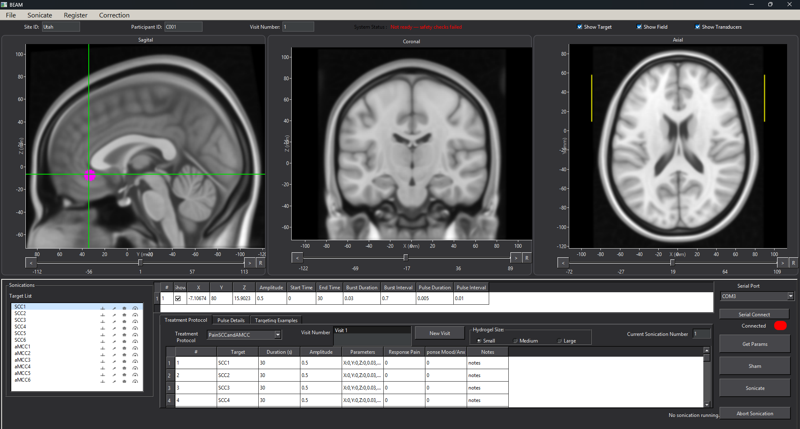

# Beam (C++ port)

C++ port of `BeamV0`.

## Conversion status

_As of 2026-09-21

| # | Category | `.m` files | Converted | Deferred | Excluded | % `.m` logic converted |
|---|----------|-----------:|----------:|---------:|---------:|------------:|
| 1 | Arrays       | 19  | 16 | 0  | [3](docs/known_gaps.md#excluded-from-this-phase-with-reasons) | 100% |
| 2 | Util         | 15  | 11 | 0  | [4](docs/known_gaps_util.md#excluded-from-this-phase-with-reasons) | 100% |
| 3 | Correction   | 22  | 17 | 0  | [5](docs/known_gaps_correction.md#excluded) | 100% |
| 4 | Stimulation  | 22  | 13 | 0  | [9](docs/known_gaps_stimulation.md#excluded) | 100% |
| 5 | MRI          | 22  | 9  | 1  | [12](docs/known_gaps_mri.md#excluded) | 90% |
| 6 | Registration | 27  | 18 | 0  | [9](docs/known_gaps_registration.md#excluded) | 100% |
| 7 | SerialCom    | 8   | 8  | 0  | 0 | 100% |
| 8 | Sham         | 3   | 2  | 0  | [1](docs/known_gaps_serialcom_sham.md#excluded-sham) | 100% |
| 9 | GUI          | 88  | 43 | 0  | [45](docs/known_gaps_gui.md#excluded-dead-code) | 100% (logic) / **[~75% (app)](docs/gui_widget_inventory.md)** |
|   | **Total**    | **226** | **137** | **1** | **88** | 99% (logic) / **~75% (GUI app)** |

## Build and test

- Build system: CMake + vcpkg, cross-platform.
- The `msvc` preset is one local example, not a platform requirement.

Dependencies (restored from `vcpkg.json`):

- `eigen3` — linear algebra
- `gtest` — unit tests
- `dcmtk` — DICOM reading (`libs/infra_dicom`)
- `qtbase` (widgets) + `qtcharts` — GUI (`libs/gui_qt`); optional, the
  build skips the Qt targets cleanly if it isn't provisioned

```powershell
cmake --preset msvc
cmake --build build-msvc --config Debug --target beam_app
cmake --build build-msvc --config Release --target beam_app
cmake --build --preset msvc
.\build-msvc\tests\Debug\unit_tests.exe   # run the exe directly; ctest is AppLocker-blocked here

.\build-msvc\apps\Release\beam_app.exe --designer-startup
.\build-msvc\apps\Release\beam_app.exe --designer-startup
```

## Test results

- **Unit tests** — 234/234 passing ([latest run](docs/test-results/latest.log)).
- **Per-function coverage** — [one row per converted function](docs/unit-test-coverage.md),
  its test, and result.
- **MATLAB parity** — the C++ ports diffed against the real BeamV0 `.m`
  functions on the same input (atol/rtol 1e-9), every non-GUI phase:
  Arrays + Util 88/88, Correction 48/48, Stimulation 28/28, MRI 69/69,
  Registration 89/89, Safety 14/14. See `matlab_verify/`.


## Screenshot


## Deferred & excluded

See [Deferred & excluded](docs/deferred-and-excluded.md) for per-phase
reasons and the current state of the GUI rebuild.
