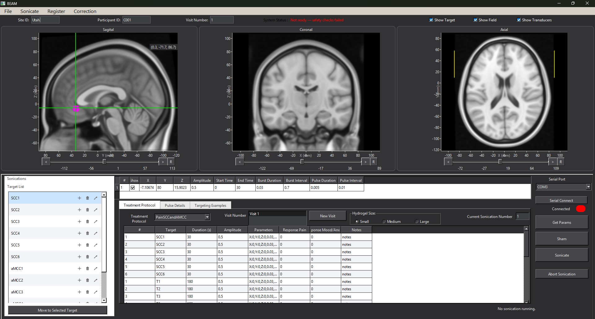
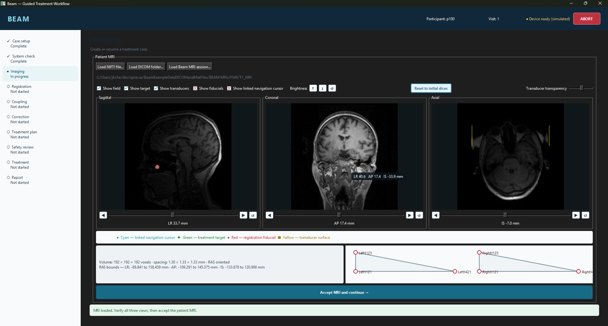

# BEAM Development Report

## Project status

> **Core functionality is complete.**

BEAM now provides two graphical user interfaces: the original all-in-one interface and a guided, workflow-based interface.

## Legacy interface

The legacy GUI presents imaging, targeting, protocol configuration, and sonication controls in a single workspace.

## Guided workflow interface

The workflow-based GUI organizes the procedure into clear stages, from case setup and system checks through treatment and reporting, while showing progress and safety status throughout the process.

## Summary

| Component | Status |
| --- | --- |
| Core logic | Complete |
| Legacy GUI | Developing |
| Workflow-based GUI | Developing |
